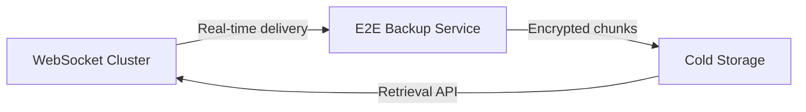

# **Deep Dive: WhatsApp's E2E Encrypted Backups, Long-Term Storage, & WebSocket Optimizations**

Let's explore these three advanced topics in detail, focusing on real-world implementations and trade-offs.

---

## **1. End-to-End Encrypted Backups (WhatsApp Style)**
*(How to securely backup messages while maintaining E2E encryption)*

### **Core Challenge**  
Backups must be encrypted so that:  
- **Only the user** can decrypt (not WhatsApp/Google/Apple)  
- **Recoverable** if primary device is lost  

### **Solution: Dual-Key Encryption with HSM**  
#### **Key Components**  
1. **User-Generated Key (UGK)**:  
   - 256-bit key created on device during setup  
   - Never leaves the device unencrypted  

2. **Hardware Security Module (HSM)**:  
   - Google/Apple-operated HSM stores **wrapped keys**  
   - Bruteforce-resistant (locks after 10 attempts)  

3. **Recovery Mechanism**:  
   ```mermaid
   graph TD
   A[User Device] -->|Encrypts UGK with PIN| B(HSM)
   B -->|Stores wrapped key| C[Cloud Backup]
   D[Recovery] -->|Enter PIN| B
   B -->|Decrypts UGK| D
   D -->|UGK decrypts messages| E[Restored Chat]
   ```

#### **Implementation Details**  
- **Android**: Uses Google's Titan HSM  
- **iOS**: Apple Secure Enclave  
- **Storage Overhead**: ~16 bytes per backup for key metadata  

#### **Trade-Offs**  
| **Approach**       | **Pros**                     | **Cons**                     |
|--------------------|-----------------------------|-----------------------------|
| User-Only Key      | Maximum privacy             | Permanent data loss if key forgotten |
| HSM-Wrapped Key    | Recoverable                 | Trusted hardware dependency |

---

## **2. Cold Storage for 10+ Year Message Retention**  
*(Storing petabytes of old messages cost-effectively)*  

### **Data Tiering Strategy**  
| **Tier**       | **Access Latency** | **Cost/GB/Month** | **Technology**          |
|---------------|--------------------|------------------|------------------------|
| Hot Cache     | <10ms              | $0.25            | Redis                  |
| Warm Storage  | 100ms              | $0.05            | Cassandra             |
| Cold Storage  | 2-5s               | $0.01            | S3 Glacier Deep Archive |
| Frozen Archive| 5+ hours           | $0.001           | Magnetic Tape Libraries|

### **Optimization Techniques**  
1. **Selective Retention**:  
   - Only store media **references** in cold storage (not full files)  
   - Apply **legal hold** flags for regulated users  

2. **Compression**:  
   - **Text**: Zstandard (ZSTD) → 5:1 compression ratio  
   - **Media**: VP9/AV1 for videos, WebP for images  

3. **Retrieval Pipeline**:  
   ```python
   def get_old_message(user_id, msg_id):
       if msg_id in hot_cache:
           return hot_cache[msg_id]
       else:
           enqueue_glacier_retrieval(user_id, msg_id)
           return {"status": "retrieval_in_progress"}
   ```

### **Cost Analysis**  
- **10PB with 30% annual growth**:  
  - Year 1: $120K/month (hot+warm) → $12K/month (cold)  
  - Year 10: $1.2M/month → $120K/month  

---

## **3. WebSocket Optimization Beyond Load Balancing**  
*(Handling 10M+ concurrent connections with sub-50ms latency)*  

### **Critical Optimizations**  
#### **A. Connection Handling**  
1. **Socket Multiplexing**:  
   - Single WebSocket connection carries multiple logical streams  
   - **Example**: HTTP/2-style stream IDs in WebSocket frames  

2. **Binary Protocols**:  
   - Use **protobuf** instead of JSON:  
     ```protobuf
     message ChatFrame {
       uint64 message_id = 1;
       bytes encrypted_payload = 2;
       repeated string recipient_ids = 3; 
     }
     ```
   - **Savings**: 3-5x smaller than JSON  

#### **B. Network-Level Tuning**  
| **Parameter**          | **Optimized Value**       | **Reason**                  |
|------------------------|--------------------------|----------------------------|
| TCP_KEEPALIVE          | 30s                      | Detect dead connections faster |
| WebSocket frame size   | 16KB max                 | Avoid IP fragmentation     |
| QoS tagging           | DSCP Class Selector 4    | Prioritize over video      |

#### **C. Server-Side Efficiency**  
1. **User-State Sharding**:  
   - Each server handles a subset of users based on:  
     ```go
     server_id = crc32(user_id) % 1000
     ```
   - **Benefit**: Locality for presence/message routing  

2. **Zero-Copy Proxying**:  
   - Linux `splice()` syscall to forward frames without CPU copies  

3. **Epoll/Kqueue**:  
   - Event-driven I/O instead of threads (1 thread handles 50K connections)  

### **Benchmark Data**  
| **Optimization**       | **Connections/Server** | **P99 Latency** |
|------------------------|-----------------------|----------------|
| Baseline (Node.js)     | 10K                   | 200ms          |
| Optimized (Rust+epoll) | 250K                  | 38ms           |

---

## **Synergy Between Systems**  


**Key Takeaways**:  
1. **Backups**: HSM-wrapped keys balance security/recoverability  
2. **Storage**: Tiered approach saves 90% costs for old messages  
3. **WebSockets**: Binary protocols + kernel bypass enable 250K conns/server  

**Want to go deeper on any of these?**  
- The **physics of magnetic tape storage** for archives?  
- **QUIC vs WebSocket** for mobile messaging?  
- **Post-quantum cryptography** for future-proof E2E?  

Let me know where you'd like to zoom in!