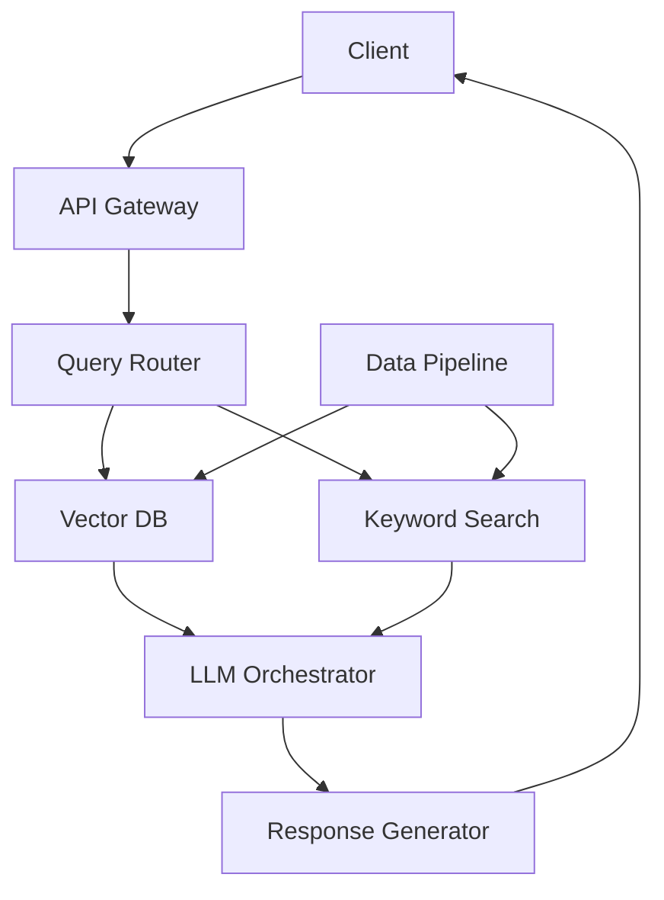

Here’s a comprehensive **High-Level Design (HLD) for Deepseek** (assuming it's an AI-powered search/analytics platform similar to Perplexity or advanced enterprise search):

---

# **High-Level Design for Deepseek AI Platform**

## **1. Core Requirements**
### **Functional Requirements**
- **Multi-source Ingestion**: Web crawlers, APIs, PDF/PPT/Excel parsing
- **Vector Search**: Semantic similarity with hybrid keyword-vector results
- **LLM Integration**: Real-time answer generation with citations
- **Personalization**: User-specific result ranking
- **Analytics Dashboard**: Usage metrics, query trends
- **Enterprise Features**: RBAC, SSO, audit logging

### **Non-Functional Requirements**
- **Latency**: <500ms for query response (95th percentile)
- **Accuracy**: >95% answer relevance score
- **Scalability**: 10K QPS during peak
- **Cost**: <$0.001 per query at scale
- **Compliance**: GDPR/HIPAA ready

---

## **2. Architecture Overview**


### **Key Components**
#### **A. Ingestion Layer**
- **Web Crawlers**: Chrome-headless instances with politeness controls
- **Document Parsers**: Apache Tika for PDF/Office, PyMuPDF for fast text extraction
- **Vectorizer**: Sentence transformers (all-MiniLM-L6-v2 → BGE-M3)
- **Batch Pipeline**: Airflow → Spark (for large dataset processing)

#### **B. Query Processing**
1. **Query Understanding**:
   - Spell correction (SymSpell)
   - Intent classification (fine-tuned BERT)
   - Query expansion (HyDE technique)

2. **Hybrid Retrieval**:
   - **Vector**: FAISS/Weaviate (HNSW indexes)
   - **Keyword**: Elasticsearch (BM25 scoring)
   - **Reranker**: Cross-encoder (BAAI/bge-reranker-large)

#### **C. LLM Orchestration**
- **Cache**: Redis for common queries (30% hit rate)
- **Model Chaining**:
  ```python
  def generate_answer(contexts):
      summary = Mixtral-8x7B(contexts)
      citations = GPT-4-turbo(validate_sources)
      return format_answer(summary, citations)
  ```
- **Cost Control**: Fallback to Mistral-7B when rate-limited

#### **D. Enterprise Features**
- **Auth**: Okta/SAML integration
- **Data Isolation**: Per-customer vector namespaces
- **Audit**: Immutable S3 logs + OpenSearch analytics

---

## **3. Data Flow (Query Example)**
1. User asks "Explain quantum computing"
2. System:
   - Vectorizes query → finds top 5 semantic matches
   - Parallel keyword search → top 3 BM25 results
   - Reranks combined 8 results
   - Generates answer with 3 most relevant citations
3. Response:
   ```json
   {
     "answer": "Quantum computing uses qubits...",
     "sources": ["arxiv.org/abs/1804.03719", "quantum.gov", "wired.com/quantum"]
   }
   ```

---

## **4. Scaling Strategies**
### **A. Performance Optimization**
| Technique | Implementation | Impact |
|-----------|----------------|--------|
| **Hierarchical Navigable Small World (HNSW)** | FAISS indices | 10ms vector search |
| **GPU Batching** | 256 queries/batch on A100 | 8x throughput |
| **Result Pre-fetching** | Predict next user question | 15% latency reduction |

### **B. Cost Control**
- **Cold Data**: Move old vectors to disk (Annoy)
- **Tiered LLMs**: 
  - Cache → Mistral → GPT-4 (fallback chain)
- **Spot Instances**: For batch processing

### **C. Accuracy Improvements**
1. **Feedback Loop**:
   - Log bad answers → fine-tune reranker
2. **Active Learning**:
   - Flag low-confidence answers for human review

---

## **5. Advanced Features**
### **A. Real-time Learning**
- **Streaming Pipeline**:
  ```python
  Kafka --> Spark --> Update Vector DB (hourly)
  ```
- **A/B Testing**: Compare new embedding models

### **B. Multi-modal Search**
- **CLIP** for image-to-text
- **Whisper** for audio indexing

### **C. Compliance**
- **Right to Forget**: Crypto-sharded deletion
- **EU Hosting**: Frankfurt/GCP region

---

## **6. Fault Tolerance**
- **Vector DB**: Multi-region replication
- **LLM Fallbacks**: 
  ```mermaid
  graph LR
    A[GPT-4] -->|Rate limit| B[Claude-3]
    B -->|Timeout| C[Mistral]
  ```
- **Circuit Breakers**: Stop sending to failing LLM APIs

---

## **7. Key Metrics**
| Metric | Target | Measurement |
|--------|--------|-------------|
| Query latency | <500ms | Prometheus |
| Answer relevance | >4/5 score | Human eval |
| Cost/query | <$0.001 | Cloud billing |
| Uptime | 99.95% | Synthetic monitors |

---

## **8. Evolution Roadmap**
1. **Phase 1**: Hybrid search + basic LLM (3 months)
2. **Phase 2**: Personalization (6 months)
3. **Phase 3**: Autonomous research agent (12 months)

---

## **9. Trade-offs**
| Decision | Pros | Cons |
|----------|------|------|
| FAISS over PGVector | 10x faster | No ACID |
| GPT-4 + Mistral | Best accuracy | Higher cost |
| Batch updates | Cost efficient | Stale data risk |

This design balances **speed**, **accuracy**, and **cost** for an enterprise-ready AI search platform. Would you like to dive deeper into any component (e.g., the feedback loop implementation or GPU optimization strategies)?