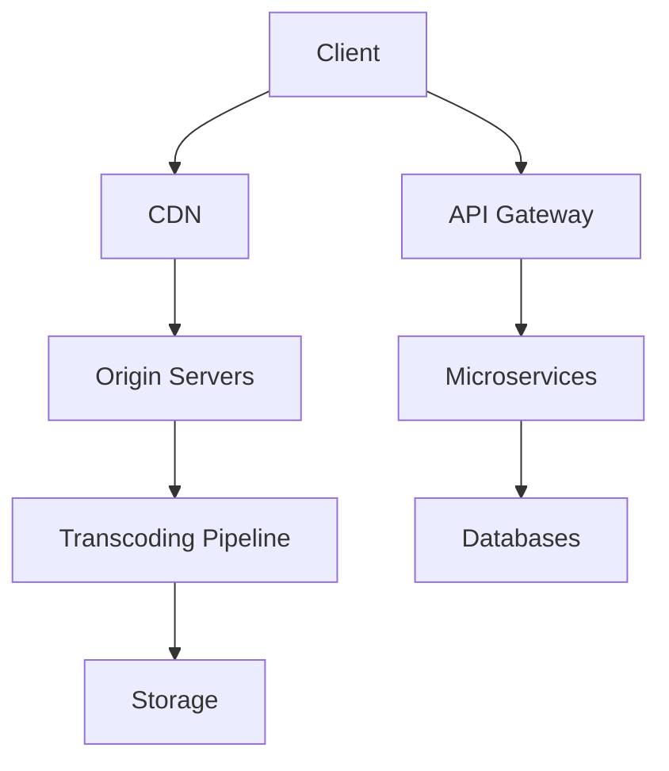

# **High-Level Design (HLD) for YouTube/Netflix**

## **1. Core Requirements**
### **Functional Requirements**
- **Video Streaming**: Adaptive bitrate (ABR) for varying network conditions
- **Content Discovery**: Search, recommendations, trending feeds
- **User Profiles**: Watch history, playlists, subscriptions
- **Upload/Ingest**: For creators (YouTube) or studio partners (Netflix)
- **Comments & Ratings** (YouTube)
- **Multi-device Sync**: Resume watching across devices

### **Non-Functional Requirements**
- **Scalability**: Handle millions of concurrent viewers
- **Low Latency**: Start playback in <2s (Netflix: <1s)
- **High Availability**: 99.99% uptime
- **Cost Efficiency**: Minimize bandwidth/storage costs
- **Security**: DRM for premium content

---

## **2. High-Level Architecture**

### **Key Components**
#### **A. Content Delivery Network (CDN)**
- **Edge Caching**: 90%+ requests served from edge nodes
- **Providers**: 
  - Netflix: Open Connect (proprietary CDN)
  - YouTube: Google Global Cache
- **Protocols**: 
  - Netflix: HTTPS + custom UDP-based streaming
  - YouTube: QUIC (HTTP/3) + WebM/MPEG-DASH

#### **B. Origin Servers**
- **Video Storage**: 
  - Hot: NVMe SSDs for popular content
  - Cold: HDDs/tape for archival (YouTube)
- **Metadata Storage**: 
  - Videos: Cassandra/DynamoDB
  - User Data: Spanner/CockroachDB

#### **C. Transcoding Pipeline**
1. **Ingest**: 
   - YouTube: VP9/AV1 (UGC)
   - Netflix: Mezzanine files (4K HDR)
2. **Transcoding**:
   - Per-title encoding (Netflix)
   - Resolution ladder (144p → 8K)
3. **Output**: 
   - HLS/DASH manifests
   - DRM-packaged (Widevine, FairPlay)

#### **D. Microservices**
| Service              | Function                           | Tech Stack          |
|----------------------|-----------------------------------|---------------------|
| **User Service**     | Profiles, auth                    | JWT, OAuth 2.0      |
| **Recommendation**   | ML-driven suggestions             | TensorFlow, PyTorch |
| **Search**           | Full-text + semantic              | Elasticsearch       |
| **Analytics**        | Viewing patterns                  | Flink + Redshift    |
| **Billing**          | Subscriptions (Netflix)           | Stripe, PostgreSQL  |

---

## **3. Data Flow Examples**
### **Video Playback (Netflix)**
1. Client → CDN (Open Connect) → Manifest file
2. CDN → ABR logic → Chunk downloads (e.g., `video_360p_segment3.m4s`)
3. Buffer management → Render frames

### **Video Upload (YouTube)**
1. Creator → Upload API → Temporary storage (GCS)
2. Transcoding farm → 10+ formats
3. Metadata indexed → Cassandra + Bigtable

---

## **4. Scaling Strategies**
### **A. Handling 10M+ Concurrent Streams**
| Technique               | Netflix                          | YouTube               |
|-------------------------|----------------------------------|-----------------------|
| **Pre-positioning**     | 95% content at edge              | Popular videos cached |
| **Protocol**            | Proprietary UDP                  | QUIC + WebRTC (Live) |
| **Failover**            | Multi-CDN fallback               | Google backbone       |

### **B. Storage Optimization**
- **Netflix**: 
  - **Per-title encoding**: Saves 20% bandwidth
  - **Tiered storage**: S3 → Glacier
- **YouTube**: 
  - **AV1 codec**: 30% smaller than H.264
  - **Colossus**: Distributed filesystem

### **C. Database Scaling**
| Data Type          | Database           | Sharding Strategy      |
|--------------------|--------------------|------------------------|
| Video Metadata     | Cassandra          | VideoID hash           |
| User Watch History | Bigtable           | UserID range           |
| Comments           | Spanner            | Interleaved tables     |

---

## **5. Advanced Features**
### **A. Recommendations**
- **Netflix**: 
  - Real-time Kafka streams → Spark ML
  - "Top 10" rankings (personalized)
- **YouTube**: 
  - Graph embeddings (user-video interactions)
  - "Up Next" algorithm

### **B. Live Streaming (YouTube)**
- **Low-latency mode**: WebRTC (500ms delay)
- **DVR**: Time-shifted playback

### **C. DRM (Netflix)**
- **Key Rotation**: Every 10s for 4K content
- **Hardware Bind**: TPM chips in devices

---

## **6. Fault Tolerance**
- **Netflix Chaos Monkey**: Randomly kills instances
- **YouTube**: 
  - Regional failover (30s detection)
  - Graceful degradation (audio-only mode)

---

## **7. Cost Management**
| Cost Center         | Optimization                     | Savings               |
|---------------------|----------------------------------|-----------------------|
| Bandwidth           | AV1/VP9 codecs                  | 30-50% reduction     |
| Storage             | Coldline storage for old videos | 70% cheaper          |
| Transcoding         | Spot instances (AWS/GCP)        | 90% cost reduction   |

---

## **8. Key Metrics**
| Metric               | Netflix            | YouTube             |
|----------------------|--------------------|---------------------|
| Daily Active Users   | 200M+              | 2B+                |
| Daily Uploads        | N/A                | 720K hours         |
| Peak Traffic         | 37% of Internet    | 4K@60fps support   |

---

## **9. Trade-Offs**
| Decision             | Pros                          | Cons                  |
|----------------------|-------------------------------|-----------------------|
| Proprietary CDN      | Lower latency, cost control   | High capex            |
| Per-title encoding   | Bandwidth savings             | 10x compute cost      |
| QUIC protocol        | Faster starts                 | Complex debugging     |

---

## **10. Evolution**
- **Netflix**: Moving to AV1 (50% bandwidth savings)
- **YouTube**: AI-powered codecs (Lyra for audio)
- Both: Edge computing for real-time effects

This architecture balances performance, cost, and scalability—proven at petabyte scale. For your implementation, prioritize either **low-latency streaming** (like Netflix) or **user-generated content** (like YouTube).