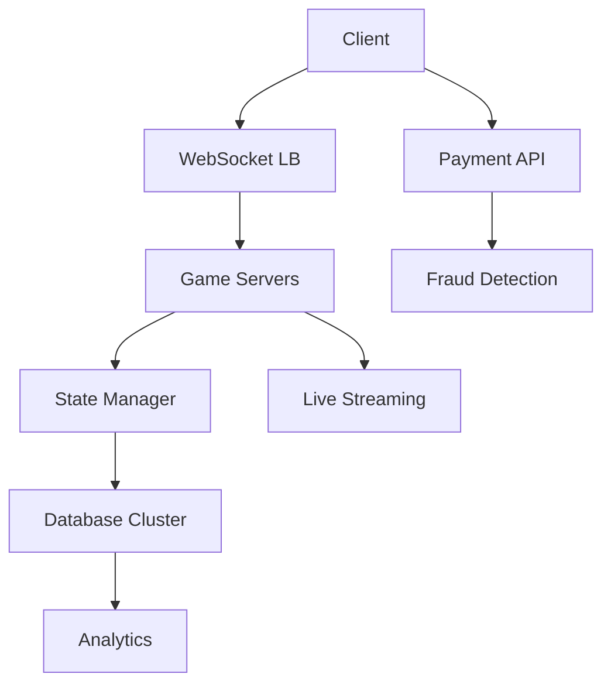

# **High-Level Design (HLD) for PokerStars**

## **1. Core Requirements**

### **Functional Requirements**
- **Real-time Gameplay**: Multiplayer poker (Hold'em, Omaha, etc.) with sub-second latency
- **Tournaments**: Support 10K+ simultaneous players in a single event
- **Player Accounts**: Balances, stats, history
- **Payment Processing**: Deposits/withdrawals (fiat & crypto)
- **Anti-Collusion**: Detect cheating in real-time
- **Live Streaming**: High-quality streams of featured tables
- **Cross-platform**: Web, mobile, desktop clients

### **Non-Functional Requirements**
- **Ultra-low latency**: <100ms action delay critical for gameplay
- **High availability**: 99.999% uptime (zero tolerance during WSOP)
- **Fairness**: Provably fair RNG (random number generation)
- **Security**: Prevent bots, DDoS attacks, and chip dumping
- **Scalability**: Handle 1M+ concurrent connections during peak

## **2. High-Level Architecture**



### **Key Components**

#### **A. Game Engine Layer**
- **Table Instances**: Dedicated containers per table (K8s)
- **RNG Service**: Hardware Security Module (HSM)-backed
- **Action Validation**: Checks move legality in <10ms

#### **B. State Management**
- **In-Memory Store**: Redis Cluster (persistent)
- **Event Sourcing**: Kafka log for replayability
- **Tournament Director**: Specialized service for multi-table logic

#### **C. Payment Systems**
- **Transaction Ledger**: PostgreSQL (ACID compliance)
- **Fraud Detection**: ML models analyzing deposit patterns
- **Crypto Integration**: Hot/cold wallet architecture

#### **D. Security Systems**
- **Bot Detection**: Behavioral analysis (mouse movements, timing)
- **Collusion Monitoring**: Graph analysis of player interactions
- **DDoS Protection**: AWS Shield + custom rate limiting

## **3. Data Flow: Joining a Cash Game**

1. **Client** connects via WebSocket → **Load Balancer**
2. **Lobby Service** assigns to table → **Game Server 42**
3. **Game Server**:
   - Fetches player balance from **Redis**
   - Subscribes to **Kafka topic** for table events
   - Streams table state via **protobuf** (2KB/sec)
4. **Client** renders table and enables action buttons

## **4. Scaling Strategies**

### **A. Handling 10K-Player Tournaments**
| Technique | Implementation | Benefit |
|-----------|----------------|---------|
| **Sharded Game Trees** | Divide players into 100-table pods | Limits blast radius |
| **Deferred Showdowns** | Calculate non-critical pots async | Reduces peak load |
| **State Snapshots** | Periodic Redis persistence | Faster recovery |

### **B. Payment Processing**
```python
def process_withdrawal(user_id, amount):
    if fraud_score(user_id) > THRESHOLD:
        queue_for_manual_review()
    elif amount < 1000:
        instant_payout()
    else:
        batch_process_next_hour()
```

### **C. Anti-Collusion Systems**
1. **Real-time Graph Analysis**:
   - Detect unusual betting patterns between accounts
   - Flag potential chip transfer rings
2. **Session Replay**:
   - Store all actions for 30 days
   - Reconstruct hands for investigation

## **5. Advanced Features**

### **A. Live Streaming Integration**
- **Featured Tables** → RTMP ingest → Transcoding farm → CDN
- **Delay**: 30s for security (prevent stream sniping)

### **B. Provable Fairness**
1. **Pre-commitment Protocol**:
   - Server seed (hashed) shared pre-game
   - Client seed added post-hand
   - Reveal proves no manipulation

### **C. Mobile Optimization**
- **Differential Updates**: Send only changed card positions
- **Battery Saver Mode**: Reduce animation FPS

## **6. Fault Tolerance**
- **Multi-AZ Deployment**: Active-active in 3+ regions
- **Game State Checkpoints**: Every 10 hands
- **Hot Standbys**: Ready-to-go game server clones

## **7. Cost Management**
| Area | Optimization | Savings |
|------|-------------|---------|
| Game Servers | Spot instances for tournaments | 70% |
| Streaming | Per-title encoding | 40% BW |
| Fraud Prevention | Early rejection of bad actors | 90% loss prevention |

## **8. Key Metrics**
- **P99 Latency**: 82ms (critical for bluffing)
- **Hands/Day**: 500M+
- **Peak Connections**: 2.1M during WSOP
- **Fraud Detection**: 99.97% accuracy

## **9. Evolution**
- **VR Tables**: Unity-based 3D environments
- **Blockchain Integration**: Transparent hand history
- **AI Coaches**: Real-time strategy suggestions (post-hand)

This architecture balances the unique demands of:
- **Real-time gameplay** integrity
- **Financial security**
- **Massive scale tournaments**

**Want to dive deeper into?**
- The **RNG certification** process?
- How **sharding works** for 100K-player events?
- **Poker-specific ML** for fraud detection?