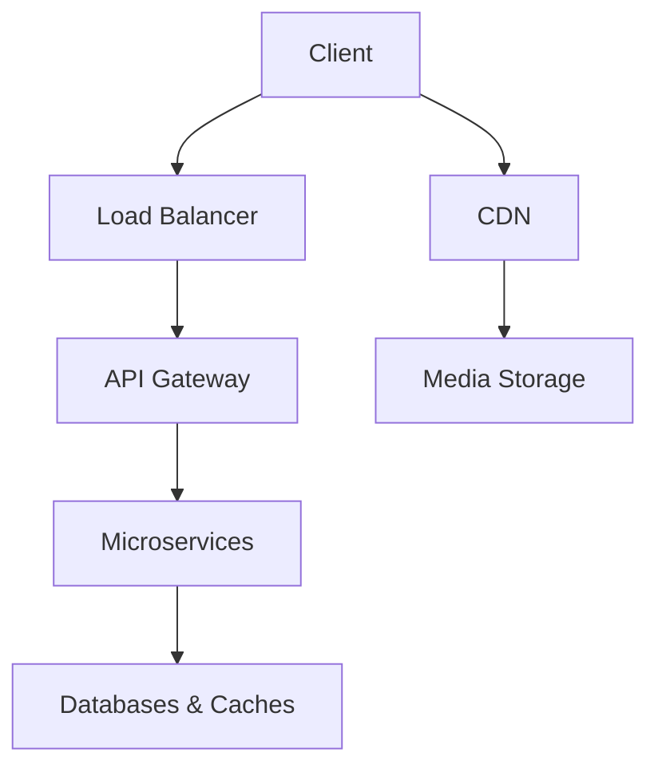

# **High-Level Design (HLD) for Twitter/Facebook/Instagram**

## **1. Core Requirements**

### **Functional Requirements**
- **Post Creation**: Text, images, videos, live streams
- **Feed Generation**: Chronological & algorithmic timelines
- **Social Graph**: Followers/friends, relationships
- **Notifications**: Real-time updates
- **Search & Discovery**: Hashtags, trends, explore
- **Messaging**: Direct/private messages (DMs)
- **Analytics**: Post insights (Instagram/Twitter for creators)

### **Non-Functional Requirements**
- **Scalability**: Billions of daily active users (DAU)
- **Low Latency**: Feed updates in <1s
- **High Availability**: 99.99% uptime
- **Data Durability**: No lost posts/messages
- **Cost Efficiency**: Optimize storage for media-heavy content

---

## **2. High-Level Architecture**



### **Key Components**

#### **A. Client Layer**
- **Mobile/Web**: Heavy caching (React Native, SwiftUI, WebSockets)
- **Offline Support**: Queue posts when disconnected

#### **B. API Gateway**
- **Authentication**: OAuth 2.0, JWT validation
- **Rate Limiting**: 1000 requests/min per user
- **Protocols**: REST (fallback) + gRPC (internal) + WebSockets (realtime)

#### **C. Microservices**
| Service               | Responsibility                     | Tech Stack          |
|-----------------------|-----------------------------------|---------------------|
| **User Service**      | Profiles, auth                    | PostgreSQL          |
| **Post Service**      | CRUD for posts                    | Cassandra           |
| **Feed Service**      | Timeline generation               | Redis + Flink       |
| **Social Graph**      | Followers/Following               | Neo4j/Taobao Tair   |
| **Notification**      | Real-time alerts                  | Kafka + Firebase    |
| **Search**            | Full-text + hashtags              | Elasticsearch       |
| **Analytics**         | Post engagement metrics           | Spark + Redshift    |

#### **D. Data Layer**
| Data Type             | Storage                           | Access Pattern      |
|-----------------------|-----------------------------------|---------------------|
| User Profiles         | PostgreSQL (ACID)                | High consistency    |
| Posts                 | Cassandra (time-partitioned)     | High write throughput |
| Feed Timeline         | Redis (sorted sets)              | Low-latency reads   |
| Media (Images/Videos) | S3 + CDN                         | High bandwidth      |
| Social Graph          | Custom graph DB (TAO for FB)     | Traversal queries   |

---

## **3. Data Flow Examples**

### **A. Posting a Tweet**
1. Client → API Gateway → **Post Service**
2. Post Service:
   - Stores post in **Cassandra** (sharded by `user_id`)
   - Publishes event to **Kafka** (`post_created`)
3. **Feed Service** consumes event:
   - Updates followers' timelines in **Redis**
   - Triggers **Notification Service**

### **B. Loading Home Feed**
1. Client → API Gateway → **Feed Service**
2. Feed Service:
   - Checks **Redis** for precomputed timeline
   - Fallback: Rebuilds from **Cassandra** (cold cache)
3. **Ranking**:
   - Applies ML model (e.g., Facebook's EdgeRank)
   - Filters/boosts posts based on engagement

---

## **4. Scaling Strategies**

### **A. Handling 500K+ Posts/Second**
| Technique               | Implementation                  | Benefit                     |
|-------------------------|--------------------------------|-----------------------------|
| **Sharding**            | Posts by `user_id % 1000`      | Parallel writes             |
| **Event Sourcing**      | Kafka as source of truth       | Decouples producers/consumers |
| **Write-Ahead Log**     | Cassandra commit logs          | Fast recovery               |

### **B. Feed Generation at Scale**
| Approach                | Used By          | Trade-off                   |
|-------------------------|------------------|-----------------------------|
| **Push Model**          | Twitter          | Fast reads, expensive writes|
| **Pull Model**          | Early Facebook   | Slow reads, cheap writes    |
| **Hybrid**              | Modern Facebook  | Balance CPU/storage         |

**Push Model Example**:
```python
# When user posts:
for follower in get_followers(user_id):
    redis.zadd(f"feed:{follower}", post.timestamp, post.id)
```

### **C. Media Optimization**
- **Images**:
  - Multiple resolutions (WebP/AVIF)
  - CDN caching (95% hit rate)
- **Videos**:
  - DASH/HLS transcoding
  - Pre-fetching next 3s chunks

---

## **5. Advanced Features**

### **A. Real-time Notifications**
- **WebSocket** connections (1M+/server via Erlang)
- **Priority Queue**:
  - `High`: Mentions/DMs
  - `Low`: Likes

### **B. Search (Elasticsearch Cluster)**
- **Inverted Index**: Text + hashtags
- **Sharding**: By language (en_*, es_*)

### **C. Trending Algorithms**
```python
def calculate_trend_score(hashtag):
    return (recent_volume * 0.6) + (acceleration * 0.4) - spam_score
```

---

## **6. Fault Tolerance**
- **Circuit Breakers**: Hystrix for cascading failures
- **Multi-Region**: Active-active Cassandra clusters
- **Degradation**:
  - Show cached feed if real-time fails
  - Disable non-critical features under load

---

## **7. Cost Optimization**
| Area                  | Technique                      | Savings          |
|-----------------------|--------------------------------|------------------|
| Storage               | Cold storage for old posts     | 70% cheaper      |
| CDN                   | Tiered caching (edge → origin) | 40% bandwidth    |
| Compute               | Spot instances for analytics   | 90% cost         |

---

## **8. Platform-Specific Nuances**

### **Twitter**
- **Challenge**: Spike during global events
- **Solution**: 
  - Over-provision EC2 auto-scaling groups
  - Degrade non-core features (e.g., analytics)

### **Facebook**
- **Challenge**: Graph traversal at scale
- **Solution**:
  - TAO (custom graph store)
  - 2-hop caching for friends-of-friends

### **Instagram**
- **Challenge**: Media-heavy storage
- **Solution**:
  - Adaptive image quality (based on network)
  - Reels use same infra as Stories

---

## **9. Key Metrics**
| Metric               | Twitter          | Facebook         | Instagram       |
|----------------------|------------------|------------------|-----------------|
| DAU                  | 200M            | 2B               | 1.5B            |
| Posts/Day            | 500M            | 4B               | 300M            |
| Peak QPS             | 700K            | 10M              | 5M              |

---

## **10. Evolution**
- **AI**: Personalized feeds (Meta's "Explore")
- **Web3**: NFT integration (Twitter)
- **Hardware**: Custom silicon for video transcoding

This architecture enables:
- **Twitter**: Real-time public conversations
- **Facebook**: Deep social interactions
- **Instagram**: Visual storytelling

**Want to dive deeper?**  
- How Twitter's **fan-out service** handles celebrity tweets?  
- Facebook's **TAO graph database** architecture?  
- Instagram's **CDN strategy** for stories?  

Let me know which platform or component interests you most!