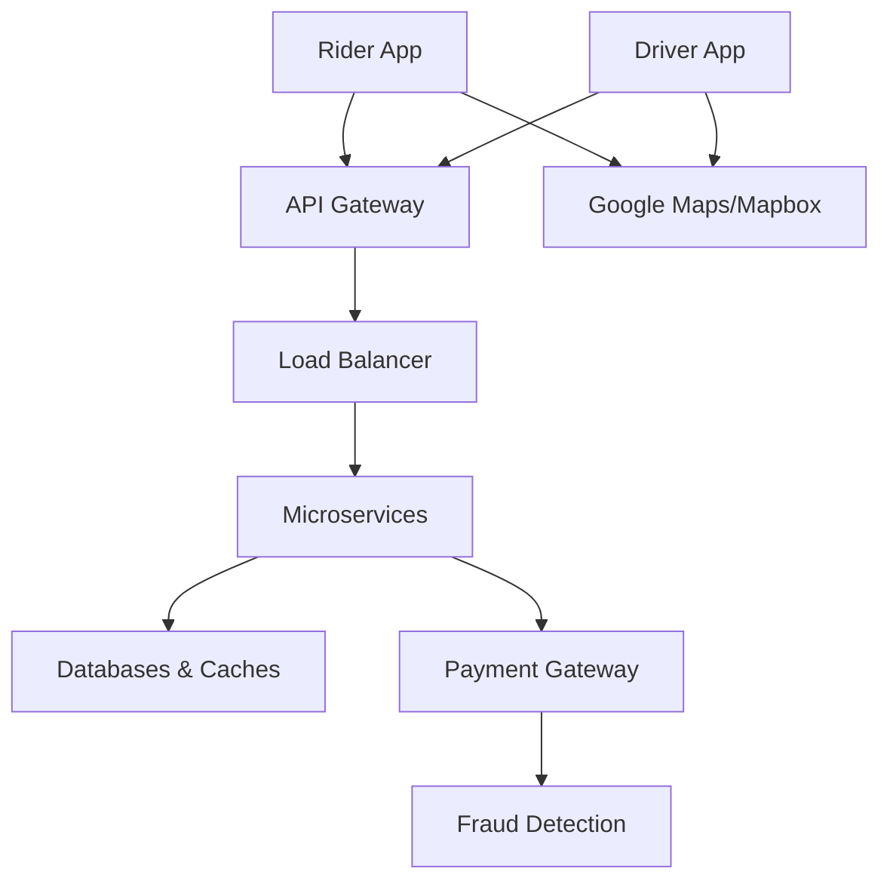

# **High-Level Design (HLD) for Uber**

## **1. Core Requirements**

### **Functional Requirements**
- **Ride Matching**: Connect riders with nearby drivers in real-time
- **Dynamic Pricing**: Surge pricing during high demand
- **Trip Tracking**: Real-time GPS updates for ETA calculation
- **Payments**: Cashless transactions with multiple methods
- **Ratings/Reviews**: Two-way feedback system
- **Multi-service Support**: UberX, Uber Black, Uber Eats, etc.
- **Dispatch System**: For scheduled rides and deliveries

### **Non-Functional Requirements**
- **Low Latency**: <1s response for driver matching
- **High Availability**: 99.99% uptime (critical during peak hours)
- **Scalability**: Handle 10M+ daily rides
- **Fault Tolerance**: No single point of failure
- **Data Consistency**: Accurate fare calculation and driver locations

---

## **2. High-Level Architecture**



### **Key Components**

#### **A. Client Layer**
- **Mobile Apps**: iOS/Android (React Native core)
- **Web**: React-based for riders
- **Real-time Updates**: WebSocket/Long Polling

#### **B. API Gateway**
- **Authentication**: OAuth 2.0
- **Rate Limiting**: Prevent abuse
- **Protocol Translation**: REST → gRPC for internal services

#### **C. Core Microservices**
| Service | Responsibility | Tech Stack |
|---------|----------------|------------|
| **Dispatch** | Driver-rider matching | Go, Kafka |
| **Pricing** | Dynamic fare calculation | Flink, Redis |
| **Tracking** | Real-time location | GPSd, PostGIS |
| **Payments** | Transaction processing | Java, PostgreSQL |
| **Notifications** | Push/SMS alerts | Twilio, Firebase |
| **ETC** | Traffic-aware routing | OSRM, GraphHopper |

#### **D. Data Layer**
| Data Type | Storage | Access Pattern |
|-----------|---------|----------------|
| Driver Locations | Redis (GeoSpatial) | 100K+ QPS reads |
| Trip State | Cassandra | High write volume |
| User Data | PostgreSQL | ACID transactions |
| Map Data | CDN + S3 | Edge caching |

---

## **3. Data Flow: Ride Request**

1. **Rider** requests ride → API Gateway
2. **Dispatch Service**:
   - Queries **Redis** for nearby drivers (GEORADIUS)
   - Runs matching algorithm (driver score = proximity × rating × vehicle type)
3. **Pricing Service**:
   - Checks demand in 100m hex grid (Flink real-time analytics)
   - Calculates surge multiplier
4. **Driver** accepts → **Trip Service** creates record in Cassandra
5. **Tracking Service** begins streaming locations (WebSocket)

---

## **4. Scaling Strategies**

### **A. Real-time Location Processing**
| Technique | Implementation | Benefit |
|-----------|----------------|---------|
| **Geohashing** | Partition drivers by S2 cells | Faster radius queries |
| **Write Delegation** | Drivers report to regional edge nodes | 300ms latency reduction |
| **Batched Updates** | Aggregate moves >50m or every 5s | 60% fewer writes |

### **B. Surge Pricing Algorithm**
```python
def calculate_surge(area_id):
    demand = redis.get(f"demand:{area_id}")
    supply = redis.get(f"supply:{area_id}")
    base = pricing_db.get_base_rate(area_id)
    return base * (1 + math.log(demand/max(1,supply)))
```

### **C. Database Scaling**
| Data | Sharding Strategy | Replication |
|------|-------------------|-------------|
| Trips | By city + hour | 3x cross-AZ |
| Payments | By user ID modulo | Active-active |
| Locations | By geohash prefix | Eventually consistent |

---

## **5. Advanced Features**

### **A. ETA Prediction**
- **Real-time Traffic**: Ingest from Waze/Google Maps
- **ML Model**: XGBoost trained on historical trip data
- **Fallback**: OSRM routing engine

### **B. Fraud Prevention**
1. **Driver Collusion Detection**:
   - Graph analysis of unusual acceptance patterns
2. **Payment Fraud**:
   - Stripe Radar integration
3. **Spoofed GPS**:
   - IMU sensor cross-validation

### **C. Uber Eats Integration**
- **Common Services**: Auth, Payments
- **Specialized**:
  - Restaurant dispatch system
  - Thermal bag tracking (IoT)

---

## **6. Fault Tolerance**

- **Circuit Breakers**: Hystrix for cascading failures
- **Graceful Degradation**:
  - Fallback to static pricing if surge system fails
  - Cached map data if routing service down
- **Chaos Engineering**: Simulate region outages

---

## **7. Cost Optimization**

| Area | Strategy | Savings |
|------|----------|---------|
| Maps | Tiling (different zoom levels) | 40% bandwidth |
| Notifications | Batched SMS | 30% cost |
| Compute | Spot instances for batch jobs | 90% savings |

---

## **8. Key Metrics**

| Metric | Target | Measurement |
|--------|--------|-------------|
| Match latency | <800ms | Prometheus |
| Location accuracy | <10m error | GPS logs |
| Payment success | >99.7% | Stripe API |
| Peak QPS | 500K+ | New Year's Eve |

---

## **9. Evolution**

- **Autonomous Vehicles**: Special dispatch layer
- **Uber Air**: 3D routing (altitude-aware)
- **Blockchain**: Driver payment settlements

---

## **10. Trade-offs**

| Decision | Pros | Cons |
|----------|------|------|
| Eventual consistency for locations | High availability | Stale reads possible |
| Geohash over R-tree | Faster writes | Less precise queries |
| Regional deployment | Lower latency | Data sync complexity |

This architecture handles Uber's unique challenges of **real-time coordination at global scale** while maintaining reliability. Would you like to explore any component in more depth? For example:
- How **driver matching algorithms** evolve during surge pricing?
- **Multi-region database synchronization** strategies?
- **Uber Eats** cold chain monitoring?