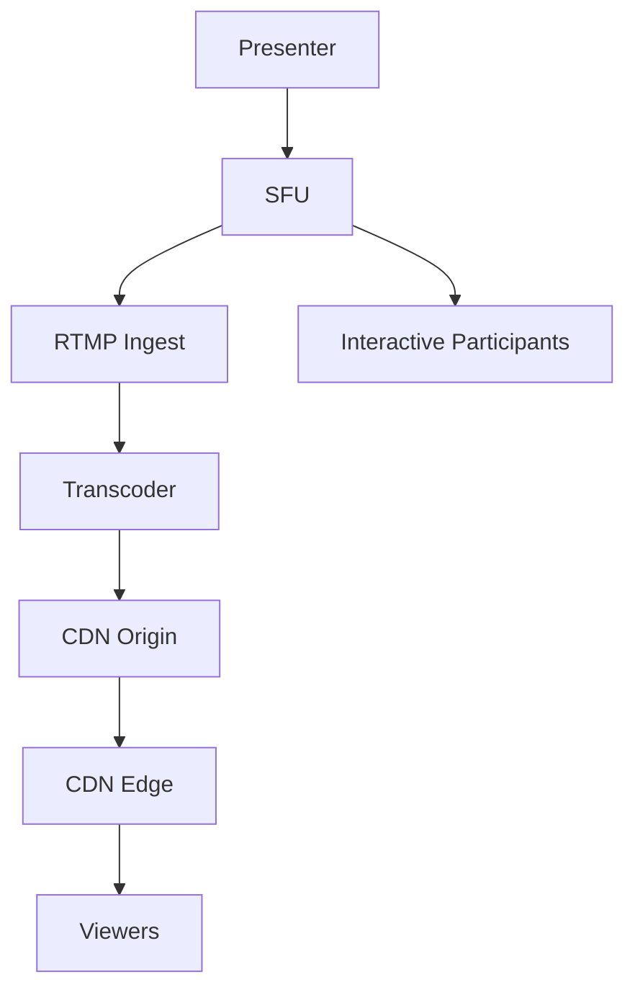

# **Live Streaming Support in Zoom/Meet-Style Systems**

To add live streaming capabilities (e.g., webinars, public broadcasts) while maintaining the core video conferencing functionality, here's how we'd architect it:

## **1. Key Requirements for Live Streaming**
- **Dual-Mode Operation**: Support both interactive meetings (SFU-based) and one-way live streams (CDN-based)
- **Scalability**: Handle 100K+ viewers with sub-10s latency
- **Hybrid Participation**: Allow some attendees to interact (video/audio) while others watch passively
- **Recording**: Simultaneous live streaming and recording
- **Quality Adaptation**: Adjust bitrate for diverse viewer networks

## **2. Architectural Additions for Live Streaming**



### **Core Components**
1. **RTMP Ingest Gateway**
   - Accepts presenter streams from SFU in RTMP/FLV format
   - Validates stream keys (authentication)

2. **Transcoding Farm**
   - Converts to:
     - **HLS/DASH** for adaptive streaming
     - Multiple resolutions (1080p → 360p)
   - GPU-accelerated (NVIDIA T4/Tensor cores)

3. **CDN Network**
   - **Origin Server**: Single source of truth for streams
   - **Edge POPs**: 1000+ locations globally (CloudFront, Akamai)
   - **Protocol Support**:
     - Low-latency HLS (3-5s delay)
     - WebRTC (<1s for premium users)

4. **Interactive Bridge**
   - Allows selected participants to "join" the stream
   - Mixes interactive audio into main stream

## **3. Data Flow for 10K+ Viewer Stream**

1. **Presenter** sends media to SFU (as normal meeting)
2. **SFU** forwards to:
   - **Interactive participants** (via WebRTC)
   - **RTMP Ingest** (for CDN distribution)
3. **Transcoder** creates:
   ```bash
   # Bitrate ladder example
   1080p: 4Mbps (H.264)
   720p: 2Mbps
   480p: 1Mbps (AV1 for compatible clients)
   ```
4. **CDN** delivers via:
   - LL-HLS to browsers
   - WebRTC to mobile apps (lowest latency)

## **4. Scaling Live Streams**

### **A. Viewer Scaling (CDN vs. SFU)**
| **Approach** | **Max Viewers** | **Latency** | **Cost** |
|--------------|----------------|------------|---------|
| Pure SFU     | 10K            | <200ms     | $$$$    |
| CDN          | 1M+            | 3-10s      | $$      |
| Hybrid       | 100K           | 1-2s       | $$$     |

### **B. Dynamic Transcoder Allocation**
- **Auto-scale rules**:
  ```python
  if viewers > 10K: spin_up_2x_transcoders()
  if bitrate_drop_detected(): switch_to_SVC()
  ```

### **C. Cost Optimization**
- **Tiered Streaming**:
  - Free users: 480p via CDN
  - Paid users: 1080p via regional SFUs

## **5. Key Challenges & Solutions**

**Problem**: Sync between live stream and interactive participants  
**Solution**: 
- NTP time sync across all components
- Buffer 500ms at CDN edge to align streams

**Problem**: Viral "flash crowds" (sudden viewer spikes)  
**Solution**:
- Pre-warm CDN capacity based on registration numbers
- Throttle non-paying users during overload

**Problem**: Recording integrity  
**Solution**:
- Dual-write to S3 (original + transcoded)
- Checksum verification before publishing

## **6. Analytics Enhancements**
- **Real-time Dashboard**:
  ```json
  {
    "viewers": 15432,
    "avg_bitrate": 1.8Mbps,
    "top_countries": ["US", "IN", "BR"],
    "buffer_health": 98.2%
  }
  ```
- **QoS Alerts**: Trigger SMS to ops team if >2% packet loss

## **7. Example Configuration**
```nginx
# CDN Edge config
location /live {
  hls_fragment 2s;
  hls_playlist_length 10s;
  low_latency on; # LL-HLS
  dash_clock_compensation on;
}
```

## **8. Comparative Latency**
| **Tech**       | **Latency** | **Use Case**              |
|----------------|------------|--------------------------|
| WebRTC         | <500ms     | Interactive webinars     |
| LL-HLS         | 3-5s       | Most live streams        |
| Regular HLS    | 10-30s     | Non-critical broadcasts  |

This architecture allows the same system to power:
- 10-person team meetings (WebRTC)
- 50K-viewer product launches (CDN)
- Hybrid events with 100 interactive + 50K passive users

**Want to explore deeper?**  
- How TikTok achieves sub-1s latency at scale?  
- Machine learning for automated stream quality optimization?  
- DRM (Digital Rights Management) for paid webinars?