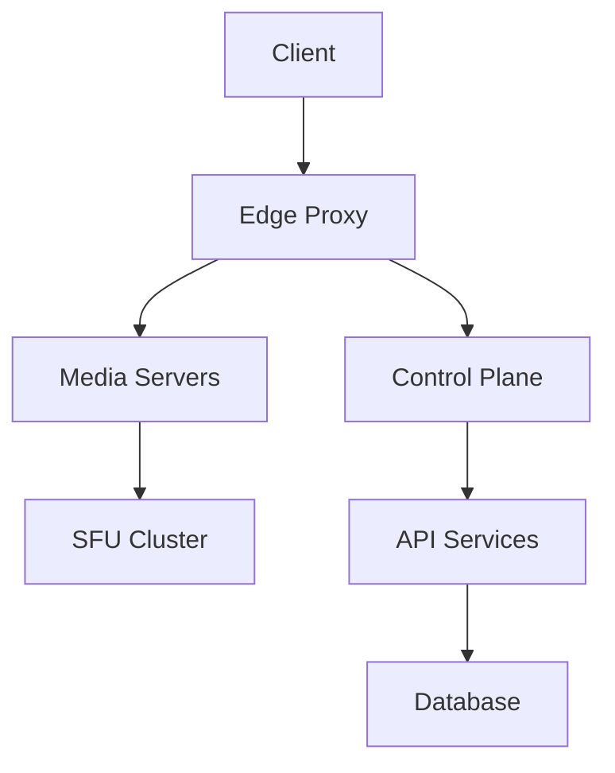
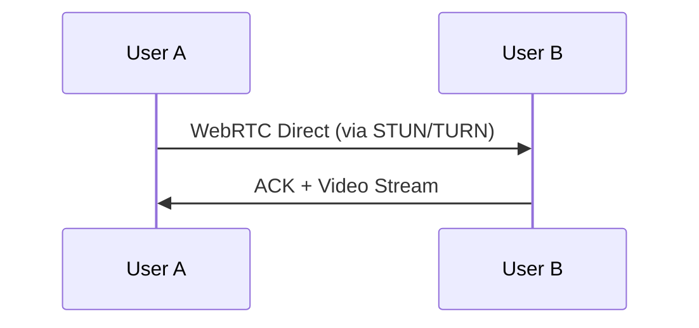

# **High-Level Design (HLD) for Zoom/Google Meet**

## **1. Requirements**
### **Functional Requirements**
- **Real-time video/audio conferencing** (1:1 & group calls)
- **Screen sharing** (with annotation support)
- **Chat messaging** (public & private)
- **Recording & playback**
- **Live captions & translations**
- **Virtual backgrounds & filters**
- **Breakout rooms** (sub-meetings)

### **Non-Functional Requirements**
- **Ultra-low latency** (<200ms end-to-end for interactive sessions)
- **High availability** (99.99% uptime)
- **Scalability** (support 100K+ concurrent meetings)
- **Adaptive bitrate streaming** (handle varying network conditions)
- **Security** (E2E encryption for enterprise tiers)
- **Cross-platform** (Web, iOS, Android, Desktop)

---

## **2. Architecture Overview**
We’ll use a **distributed microservices architecture** with selective peer-to-peer (P2P) routing for small groups and SFU (Selective Forwarding Unit) for large meetings.

### **Key Components**
1. **Edge Proxy Layer**
   - Geolocated proxies (Cloudflare, Google GLB)
   - Handles TLS termination, DDoS protection

2. **Control Plane**
   - **Meeting Orchestrator**: Manages room state, permissions
   - **Auth Service**: JWT validation, SSO integration
   - **Chat Service**: Pub/sub for text messages (like Slack)

3. **Media Plane**
   - **SFU (Selective Forwarding Unit)**: Routes video streams (1 input → N outputs)
   - **TURN/STUN Servers**: NAT traversal for P2P fallback
   - **Transcoding Farm**: H.264/VP9, SVC (Scalable Video Coding)

4. **Data Layer**
   - **Meetings Metadata**: PostgreSQL (ACID for payments/recordings)
   - **Chat History**: Cassandra (high write throughput)
   - **Recordings**: S3 + CDN (cold storage after 30 days)

---

## **3. Real-Time Media Flow**
### **For 1:1 Calls (P2P Optimized)**

### **For Group Calls (SFU Model)**
1. Each participant sends **one stream** to the SFU
2. SFU selectively forwards streams based on:
   - **Speaker activity** (loudest N speakers)
   - **Client bandwidth** (adaptive bitrate)
   - **Tile view logic** (send lower res for non-active speakers)

---

## **4. Scaling Strategies**
### **A. Media Servers**
- **Dynamic SFU Allocation**: Spin up SFUs per region based on demand (Kubernetes)
- **Bare Metal for Transcoding**: GPUs outperform VMs for video processing

### **B. Network Optimization**
| **Technique**          | **Benefit**                              | **Implementation**              |
|------------------------|----------------------------------------|--------------------------------|
| FEC (Forward Error Correction) | Reduces retransmissions            | XOR-based packet recovery      |
| Simulcast              | Sends 3 resolutions simultaneously   | SFU picks based on client BW   |
| SVC (Scalable Video Coding) | Layer-based quality adaptation   | VP9-SVC or AV1                |

### **C. Database Scaling**
- **WebRTC SDP Negotiation**: Stored in Redis (TTL=meeting duration)
- **Recordings Metadata**: Sharded by `meeting_id` (Cassandra)

---

## **5. Failure Handling**
- **SFU Failover**: Stateless SFUs → re-connect to another instance in <1s
- **Recording Durability**: Write-ahead logs (Kafka) → S3 async upload
- **Degraded Mode**: Drop video → audio-only if network deteriorates

---

## **6. Security**
- **DTLS-SRTP**: Encrypted media streams
- **Role-Based Access**: 
  - Host: Can mute/kick participants
  - Enterprise: E2EE with key rotation
- **Anti-Abuse**: 
  - Rate-limiting per IP
  - CAPTCHA for web clients

---

## **7. Analytics & Monitoring**
- **Real-Time Metrics**: Jitter, packet loss (Prometheus)
- **QoE (Quality of Experience)**: 
  - MOS (Mean Opinion Score) for audio
  - Frozen frames detection for video

---

## **8. Cost Optimization**
- **Spot Instances**: For non-live components (recording processing)
- **Bandwidth Savings**: 
  - 30% reduction via SVC
  - 50% via audio prioritization in poor networks

---

## **9. Example Scale Numbers**
| **Metric**               | **Value**                              |
|--------------------------|---------------------------------------|
| Concurrent meetings      | 100K+ (1M+ participants)              |
| Media throughput         | 10Tbps+ peak                          |
| Recording storage        | 50PB+ (with 30-day retention)         |
| API requests/sec         | 500K+ (join/leave events)             |

---

## **10. Trade-Offs**
| **Decision**             | **Pros**                              | **Cons**                          |
|--------------------------|--------------------------------------|----------------------------------|
| SFU over MCU             | Scales better                        | Higher server costs              |
| SVC over Simulcast       | Better bandwidth adaptation          | Complex client implementation    |
| P2P for 1:1             | Reduces server load                  | NAT traversal challenges         |

---

**Next Steps?**  
- Deep dive into **SVC vs Simulcast** trade-offs?  
- How **Zoom's global network backbone** works?  
- **AI noise cancellation** architecture?  

Let me know which area to explore further!